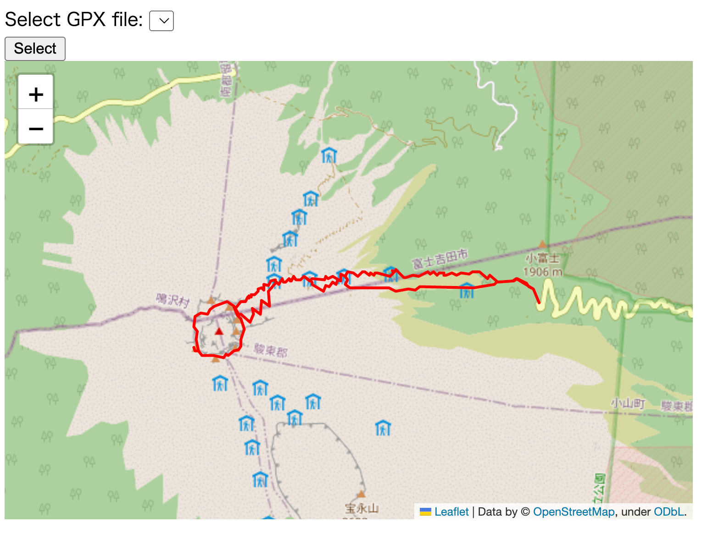

# tz_flask_20230311_route
show route map from gpx file

## how to run 
* export FLASK_APP=app.py
* export FLASK_ENV=development
* flask run
When want to use another gpx file, go back to the previous page to select file.

## how to deploy
* static/***.gpx(set gpx files here)
* static/2023.html(created by app.py)
* templates/index.html
* app.py

## html view
 

